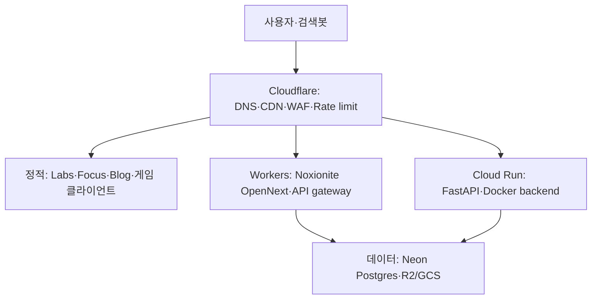

# Leap Signal Labs 저비용 웹 배포 아키텍처 보고서

> 작성 기준: 2026-07-12 (KST)  
> 대상: Noxionite, Focus Royale, DermaTier, Eclipse Voyager, 개인 블로그, Leap Signal Labs 통합 포털

## 0. 결론부터

현재 단계에서 **모든 서비스를 한 대의 VPS에 넣는 것**을 1순위로 권하지 않는다. 가장 적합한 구조는 다음의 하이브리드다.

1. **Cloudflare를 모든 공개 트래픽의 입구**로 사용한다.
   - DNS, HTTPS, CDN, WAF, 봇 차단, 요청 제한을 담당한다.
   - 정적 사이트와 정적 파일은 Cloudflare Workers Static Assets에 둔다.
   - Noxionite의 Next.js SSR/ISR는 Cloudflare Workers + OpenNext로 옮긴다.
2. **PostgreSQL은 제품별 Neon 프로젝트**로 분리한다.
   - 초기에는 무료 범위, 실제 유료 사용자가 생긴 제품만 사용량 기반 Launch 요금제로 올린다.
3. **FastAPI나 일반 Docker가 꼭 필요한 서버만 Google Cloud Run**에 둔다.
   - 요청이 없으면 0개 인스턴스로 줄어드는 컨테이너 서비스다.
   - GitHub push 자동 배포가 가능하다.
4. **이미지·게임 파일·백업은 Cloudflare R2**에 둔다.
5. 항상 켜져 있어야 하는 프로세스나 실시간 게임 서버가 생길 때만 **VPS + Coolify**를 추가한다.

예상 비용은 트래픽이 작은 현재 단계에서 대략 **월 $5~15**다. 핵심 고정비는 계정 전체에 적용되는 Cloudflare Workers Paid의 월 $5이고, 정적 요청은 무료·무제한이다. 데이터베이스와 Docker API는 사용량이 작으면 무료 범위에 머물 수 있다. 다만 이는 보장이 아니라 워크로드를 전제로 한 추정치다.

이 구조를 한 문장으로 요약하면 다음과 같다.

> **정적인 것은 무료 캐시에, Next.js 서버 렌더링은 엣지에, Python/Docker는 요청형 컨테이너에, 영속 데이터는 관리형 PostgreSQL에 둔다.**

---

## 1. 지금 장애가 난 진짜 이유

문제는 단순히 “Vercel이 비싸다”가 아니다. 다음 네 가지가 겹쳤을 가능성이 높다.

### 1.1 SSR을 정적 페이지에도 사용했다

SSR은 방문자가 페이지를 요청할 때마다 서버가 React 코드를 실행해 HTML을 만드는 방식이다. 사람이 한 번 방문하든 봇이 만 번 방문하든 만 번의 서버 연산이 발생할 수 있다.

반면 제품 소개, 블로그 글, 게임 다운로드 화면처럼 모든 사람에게 같은 내용은 매 요청마다 다시 만들 필요가 없다. 미리 HTML 파일로 만들어 CDN에서 전달하면 봇이 몰려와도 서버 연산이 거의 없다.

### 1.2 “빠른 라우팅”과 SSR을 혼동했을 가능성이 있다

SSR은 주로 첫 화면의 HTML, 검색엔진 노출, 소셜 미리보기 때문에 사용한다. 페이지 사이를 빠르게 이동하는 기능은 Next.js의 클라이언트 라우터가 담당하므로 **빠른 라우팅 자체에는 SSR이 필수가 아니다.**

### 1.3 비용이 발생하는 요청 앞에 방어선이 없었다

봇이 서버 렌더링 경로, 이미지 최적화 URL, 검색 API처럼 비싼 경로를 반복 호출하면 사용량이 급격히 증가한다. 필요한 방어선은 다음 순서다.

1. WAF와 봇 판별
2. IP·세션·API 키별 rate limit
3. 공개 HTML의 CDN 캐시
4. 마지막으로 서버 연산

### 1.4 여러 제품이 한 Vercel 계정의 사용량과 장애 범위를 공유했다

코드는 서로 다른 프로젝트여도 결제 계정과 사용량 제한이 같으면 한 제품의 봇 트래픽이 다른 제품까지 멈출 수 있다. 앞으로는 제품을 독립 서비스로 유지하되, 공통 보안 규칙·도메인·배포 목록만 중앙에서 관리해야 한다.

---

## 2. 용어를 먼저 정리하면

| 용어 | 쉬운 뜻 | 서버 비용 | 적합한 곳 |
|---|---|---:|---|
| CSR | 빈 HTML과 JavaScript를 보내고 사용자의 브라우저가 화면을 만듦 | 매우 낮음 | 로그인 후 대시보드, 게임 UI |
| SSG | 배포할 때 HTML을 미리 만들어 둠 | 거의 0 | 랜딩 페이지, 블로그, 문서 |
| SSR | 요청이 올 때마다 서버가 HTML을 만듦 | 요청마다 발생 | 사용자별·요청별 HTML이 반드시 필요한 화면 |
| ISR | 처음 만들거나 일정 시간이 지난 뒤 다시 만들어 캐시함 | 갱신할 때만 발생 | 자주 바뀌지는 않는 공개 페이지 |
| CDN | 완성된 파일을 사용자와 가까운 전 세계 서버에 복사해 전달 | 매우 낮음 | HTML, JS, CSS, 이미지, 게임 파일 |
| WAF | 악성 HTTP 요청을 애플리케이션에 도달하기 전에 막는 방화벽 | 원본 서버 비용을 줄임 | 모든 공개 서비스 |
| PaaS | 서버 운영 대신 코드나 Docker만 올리면 플랫폼이 실행해 주는 서비스 | 편하지만 서비스별 과금 | Cloud Run, Railway, Render 등 |
| VPS | 한 대의 가상 Linux 서버를 월 단위로 빌리는 것 | 고정비 | 항상 켜진 서버, 장기 작업, 특수 프로세스 |
| Coolify | 자기 VPS에 설치하는 Vercel/Railway와 비슷한 배포 관리 화면 | 소프트웨어는 무료 | 여러 Docker 서비스를 한 VPS에서 관리할 때 |

Next.js에는 네 방식이 한 프로젝트 안에 섞여 있을 수 있다. 따라서 “Noxionite는 SSR 사이트”라고 한 덩어리로 판단하지 말고 **라우트별로** 분류해야 한다.

---

## 3. 선택지별 상세 비교

### 선택지 A. Cloudflare + Neon + Cloud Run — 최종 추천

#### 무엇인가

- **Cloudflare Workers Static Assets**: 빌드 결과인 HTML, JavaScript, CSS, 이미지 등을 전 세계 CDN에서 제공한다.
- **Cloudflare Workers**: 짧은 서버 코드를 사용자와 가까운 Cloudflare 데이터센터에서 실행한다.
- **OpenNext**: Vercel용으로 작성된 Next.js 기능을 Cloudflare Workers에서 실행할 수 있게 변환하는 어댑터다.
- **Neon**: 서버를 직접 관리하지 않고 사용하는 순수 PostgreSQL 서비스다. Supabase처럼 많은 기능을 한꺼번에 제공하는 백엔드 플랫폼이라기보다, PostgreSQL의 실행·저장·백업을 관리해 주는 서비스에 가깝다.
- **Google Cloud Run**: Docker 컨테이너를 실행하고 요청이 없을 때 0개로 줄이는 관리형 서비스다. FastAPI를 거의 그대로 배포할 수 있다.
- **R2**: 이미지, 첨부 파일, 게임 리소스, 데이터베이스 백업 같은 큰 파일을 저장하는 객체 스토리지다.

#### 비용 근거

- Cloudflare Workers Paid는 **계정당 월 최소 $5**이며, 월 1,000만 동적 요청과 3,000만 CPU-ms가 포함된다. 초과분은 요청 100만 건당 $0.30, CPU 100만 ms당 $0.02이고 데이터 전송료는 별도로 받지 않는다. 정적 파일 요청은 무료·무제한이다. [Cloudflare Workers 공식 가격](https://developers.cloudflare.com/workers/platform/pricing/)
- Workers 무료 플랜은 하루 10만 요청이지만 요청당 CPU가 10ms로 제한된다. Next.js SSR을 안정적으로 운영하려면 월 $5 유료 플랜을 예산에 넣는 편이 현실적이다. [Workers 공식 제한](https://developers.cloudflare.com/workers/platform/limits/)
- R2는 매월 Standard 저장공간 10GB, Class A 100만 회, Class B 1,000만 회와 인터넷 egress가 무료다. [R2 공식 가격](https://developers.cloudflare.com/r2/pricing/)
- Neon 무료 플랜은 최대 100개 프로젝트, 프로젝트마다 월 100 CU-hour, 저장공간 0.5GB, egress 5GB를 제공하며 유휴 상태에서 0으로 줄어든다. 중요한 실서비스는 사용량 기반 Launch로 올릴 수 있고 월 최소금액이 없다. Neon이 제시한 가벼운 유료 예시는 월 $2.31이다. [Neon 플랜](https://neon.com/docs/introduction/plans), [Neon 가격](https://neon.com/pricing)
- Cloud Run 요청 기반 과금에는 매월 200만 요청, 180,000 vCPU-second, 360,000 GiB-second의 무료 할당량이 있다. 무료 할당량은 `us-central1` 가격 기준으로 계산되므로 서울·싱가포르 리전에서는 같은 사용량에도 소액이 생길 수 있다. [Cloud Run 공식 가격](https://cloud.google.com/run/pricing)

#### 장점

- 봇이 정적 페이지를 많이 읽어도 정적 요청이 서버 연산을 소모하지 않는다.
- Next.js를 전부 다시 작성하지 않고 OpenNext로 옮길 수 있다. App Router, Pages Router, SSR, SSG, ISR, Server Actions 등 대부분의 주요 기능이 지원된다. [Cloudflare Next.js 지원표](https://developers.cloudflare.com/workers/framework-guides/web-apps/nextjs/)
- Python/FastAPI는 Docker로 Cloud Run에 그대로 올릴 수 있다.
- 서버 OS 업데이트, Docker daemon 장애, 디스크 증설을 직접 관리하지 않아도 된다.
- 서비스가 제품별로 분리되어 한 제품 배포 실패가 다른 제품을 직접 중단시키지 않는다.
- 사용자가 적은 제품은 거의 비용이 없고, 사용자가 생긴 제품만 자연스럽게 비용이 증가한다.

#### 단점과 대응

- Cloudflare, Google, Neon 세 곳을 사용한다. 대신 각 서비스가 맡는 역할을 명확히 고정하고 중앙 서비스 카탈로그를 두면 관리 복잡도는 낮다.
- Cloud Run과 Neon은 유휴 후 첫 요청에서 cold start가 생길 수 있다. 유료 사용자가 생긴 핵심 서비스만 최소 인스턴스나 Neon always-on을 켠다.
- Google Cloud의 예산은 알림이지 완전한 지출 차단 장치가 아니다. Cloud Run 서비스별 최대 인스턴스를 처음에는 2~3으로 제한해야 한다. Google도 비용 방어를 위해 3부터 시작하도록 권장한다. [Cloud Run 최대 인스턴스](https://docs.cloud.google.com/run/docs/configuring/max-instances-limits), [Google Cloud 예산의 한계](https://docs.cloud.google.com/billing/docs/how-to/budgets)
- Cloud Run의 기본 공개 URL을 그대로 두면 Cloudflare를 우회할 수 있다. 중요한 API는 Cloud Run IAM 인증을 사용하고, Cloudflare Worker가 서명된 ID token으로 호출하는 구조가 가장 강하다. 초기 비민감 API라면 최소한 별도 서명 헤더를 검증하되, 이는 컨테이너 실행 전 차단이 아니므로 최종 보안 구조로 보지는 않는다.

#### 평가

현재 요구사항인 **낮은 비용, 자동 배포, 한국에서의 속도, Docker/FastAPI 호환, 낮은 운영 부담**을 가장 균형 있게 만족한다.

---

### 선택지 B. Cloudflare 안에서 Containers까지 모두 사용

Cloudflare Containers는 Workers Paid에서 Docker 이미지를 실행하는 서비스다. Python/FastAPI도 실행할 수 있고 요청이 없으면 컨테이너를 잠재워 비용을 줄일 수 있다. 기본 월 $5에 25 GiB-hour 메모리, 375 vCPU-minute, 200 GB-hour 디스크 사용량이 포함된다. [Cloudflare Containers 가격](https://developers.cloudflare.com/containers/pricing/)

#### 장점

- 공개 입구, Next.js, Docker API, 파일 저장을 Cloudflare 한 계정에서 관리할 수 있다.
- 컨테이너의 원본 공개 주소를 따로 노출하지 않고 Worker가 먼저 요청을 검사할 수 있다.
- 사용하지 않을 때 0으로 줄여 저사용 서비스의 비용이 낮다.

#### 단점

- 현재 문서상 일반적인 stateless 앱을 위한 내장 자동 스케일링이 아직 없다. 여러 인스턴스 중 하나로 보내는 라우팅을 직접 구성해야 한다.
- 완전히 꺼진 컨테이너의 cold start가 보통 1~3초다.
- 로컬 디스크는 임시 저장소라 컨테이너가 잠들면 사라진다. PostgreSQL을 컨테이너 안에 넣으면 안 된다.
- Workers, Durable Objects, Containers라는 개념을 함께 알아야 하므로 Cloud Run보다 초기 설정이 어렵다. [Cloudflare Containers FAQ](https://developers.cloudflare.com/containers/faq/)

#### 평가

향후 플랫폼이 더 성숙하면 매우 매력적인 단일 공급자 구성이 될 수 있다. 지금은 내부 도구, 저트래픽 API, 짧은 작업에 적합하고, DermaTier 같은 중요한 API의 첫 선택으로는 더 성숙한 Cloud Run을 권한다.

---

### 선택지 C. VPS 한 대 + Coolify

#### 무엇인가

VPS는 Hetzner, AWS, Vultr 같은 회사에서 Linux 컴퓨터 한 대를 빌리는 것이다. Coolify를 설치하면 GitHub 저장소를 연결하고, Docker 빌드, 환경변수, 도메인, HTTPS, 자동 배포를 웹 화면에서 관리할 수 있다. Coolify 자체는 오픈소스이며 self-hosted 버전의 기능은 무료다. GitHub push와 PR preview 배포도 지원한다. [Coolify 소개](https://coolify.io/docs/get-started/introduction), [GitHub 자동 배포](https://coolify.io/docs/applications/ci-cd/github/overview)

#### 현재 Hetzner 비용에서 주의할 점

2026년 6월 15일 가격 조정 후 Hetzner의 가격은 과거 블로그 글과 크게 다르다.

- 독일 `CX23`: 2 vCPU, 4GB RAM, 40GB SSD가 월 €5.49
- 싱가포르 `CPX22`: 2 vCPU, 4GB RAM, 80GB SSD가 월 €26.49
- 별도 IPv4는 월 €0.50
- 자동 백업은 서버 가격의 20%이며 최근 7개 백업 슬롯을 제공한다.

가격은 부가세 제외다. [2026 Hetzner 가격표](https://docs.hetzner.com/general/infrastructure-and-availability/price-adjustment/), [IPv4와 서버 가격](https://docs.hetzner.com/cloud/servers/overview/), [백업 과금](https://docs.hetzner.com/cloud/billing/faq/)

따라서 독일 서버에 백업과 IPv4를 더하면 약 €7.09/월이지만 한국 사용자에게 DB 왕복 지연이 크다. 싱가포르 서버는 같은 조건에서 약 €32.29/월이다. 이는 계산상 추정치이며 세금은 포함하지 않았다.

#### 장점

- Docker로 실행되는 것은 거의 모두 올릴 수 있다.
- 앱 수가 늘어도 서버 자원이 남는 동안 서비스별 기본요금이 추가되지 않는다.
- 비용이 비교적 고정적이고 데이터·실행 환경을 완전히 통제한다.
- WebSocket, 긴 background job, cron, 자체 Redis, 특수 바이너리처럼 serverless에 불편한 작업에 좋다.

#### 단점

- OS와 Coolify 업데이트, SSH 보안, 방화벽, 디스크, 모니터링, 백업 복구를 직접 책임져야 한다.
- 한 대가 죽으면 그 안의 모든 앱과 자체 PostgreSQL이 함께 죽는 단일 장애점이다.
- 봇 트래픽이 Cloudflare를 우회해 원본 IP를 공격하지 못하도록 별도 잠금이 필요하다.
- 작은 VPS에서 여러 Next.js 앱을 동시에 빌드하면 메모리가 부족해질 수 있다. 빌드는 GitHub Actions에서 하고 완성된 Docker image만 서버가 가져오는 구조가 더 안전하다.
- PostgreSQL까지 같은 서버에 넣으면 “싸다”는 장점과 맞바꾸어 데이터 손실·복구 책임이 커진다.

#### 언제 이 선택지가 더 좋아지는가

- 항상 실행되는 백그라운드 프로세스가 생겼다.
- 긴 WebSocket 연결이나 실시간 멀티플레이 서버가 핵심이다.
- 여러 serverless 컨테이너의 실제 월 비용이 2개월 이상 VPS보다 높다.
- 한 서비스가 지속적으로 CPU와 메모리를 사용해 scale-to-zero의 장점이 없다.
- 직접 운영할 시간과 자동 복구·백업 체계를 마련했다.

#### 평가

“Supabase 다음 단계”라고 해서 곧바로 자체 PostgreSQL과 VPS로 가야 하는 것은 아니다. VPS는 자유도를 사는 대신 운영 책임도 함께 사는 선택이다. 현재 서비스 대부분은 정적 또는 저트래픽이므로 **지금 당장은 자원을 놀리면서 운영 부담만 늘릴 가능성**이 높다.

---

### 선택지 D. Railway, Render, Fly.io 같은 관리형 PaaS

#### Railway

- Hobby는 월 최소 $5이고 그 $5가 첫 사용량에 포함된다.
- 메모리·CPU·볼륨·egress를 초 단위로 과금하며 GitHub push 자동 배포와 Docker를 지원한다.
- 현재 공개 단가는 메모리 약 $10/GB-month, CPU 약 $20/vCPU-month, egress $0.05/GB다. [Railway 가격](https://railway.com/pricing), [GitHub 자동 배포](https://docs.railway.com/deployments/github-autodeploys)

장점은 가장 빠르게 시작할 수 있다는 점이다. 단점은 여러 항상 켜진 서비스가 생기면 $5를 쉽게 넘고, Vercel에서 겪은 것처럼 사용량 기반 과금과 계정 단위 비용 관리 문제를 다른 형태로 다시 만날 수 있다는 점이다. Railway는 compute hard limit을 제공하므로 쓴다면 반드시 설정해야 한다. [Railway 비용 제한](https://docs.railway.com/pricing/cost-control)

#### Render

- 무료 웹 서비스는 15분 유휴 후 꺼지고 다시 켜는 데 약 1분이 걸린다.
- 무료 시간은 workspace 전체에 월 750시간이며 무료 PostgreSQL은 30일 후 만료된다.
- 유료 Starter 웹 서비스는 서비스 하나당 월 $7에 512MB다. 세 개만 항상 켜도 DB 전 월 $21이다. [Render 무료 제한](https://render.com/docs/free), [Render 가격](https://render.com/pricing)

개별 데모에는 좋지만 여러 제품을 저비용으로 항상 운영하려는 목적에는 맞지 않는다.

#### Fly.io

- Tokyo와 Singapore 리전이 있고, 작은 Machine은 지역에 따라 256MB가 대략 월 $2대, 1GB가 월 $6~9대다.
- 유휴 Machine 자동 정지·시작을 지원한다. [Fly.io 가격](https://fly.io/docs/about/pricing/), [리전](https://fly.io/docs/reference/regions/), [자동 정지·시작](https://fly.io/docs/launch/autostop-autostart/)
- 다만 `fly.toml`, Machine, Volume, 네트워크를 직접 이해해야 해 Railway보다 운영 난도가 높다. 저가 Fly Postgres는 공식적으로 unmanaged이며, 완전 관리형 PostgreSQL은 1GB 기본 플랜이 월 $38부터다. [Fly Postgres 구분](https://fly.io/docs/postgres/), [Managed Postgres 가격](https://fly.io/docs/mpg/)

#### 평가

한두 개 Docker 앱을 오늘 당장 띄우는 데는 좋다. 하지만 다섯 개 이상의 제품을 한 브랜드 아래 장기 운영할 때는 Cloudflare-first 구조보다 정적 비용 효율이 낮고, VPS보다 총비용 예측이 어렵다.

---

### 선택지 E. Oracle Cloud Always Free + Coolify

Oracle Always Free는 현재 Arm 기반 총 2 OCPU·12GB RAM, 200GB block storage와 여러 무료 네트워크 자원을 제공한다. 수치만 보면 Coolify와 여러 앱을 무료로 운영하기에 매우 좋아 보인다. [Oracle Always Free 공식 문서](https://docs.oracle.com/en-us/iaas/Content/FreeTier/freetier_topic-Always_Free_Resources.htm)

그러나 다음 이유로 핵심 실서비스에는 권하지 않는다.

- 지역에 무료 인스턴스 capacity가 없어 생성이 실패할 수 있다.
- 7일 동안 CPU·네트워크·A1 메모리 사용률이 각각 기준보다 낮으면 idle 인스턴스로 판단해 회수할 수 있다. 공식 기준은 95백분위 CPU 20% 미만, 네트워크 20% 미만, A1 메모리 20% 미만이다.
- 저트래픽 서비스일수록 이 회수 조건에 정확히 해당한다.

비용이 0인 실험·staging 서버로는 좋지만 Leap Signal Labs 전체의 유일한 production 서버로 두면 안 된다.

---

## 4. 선택지 요약표

| 구조 | 저트래픽 월비용 | 자동 배포 | 운영 난도 | 봇 비용 방어 | FastAPI/Docker | 현재 추천도 |
|---|---:|---|---|---|---|---|
| Cloudflare + Neon + Cloud Run | 약 $5~15 | 좋음 | 낮음~중간 | 매우 좋음 | 매우 좋음 | **1위** |
| Cloudflare + Containers + Neon | 약 $5~15 | 좋음 | 중간 | 매우 좋음 | 좋음 | 2위, 비핵심부터 |
| VPS + Coolify | 지역에 따라 약 €7~32+ | 좋음 | 중간~높음 | 설정에 달림 | 매우 좋음 | 필요가 생길 때 |
| Railway | $5부터, 사용량 증가 | 매우 좋음 | 낮음 | 별도 Cloudflare 필요 | 매우 좋음 | 빠른 실험용 |
| Render | 무료 데모 또는 서비스당 $7부터 | 매우 좋음 | 낮음 | 별도 Cloudflare 필요 | 좋음 | 데모용 |
| Fly.io | 작은 Machine당 약 $2부터 | 좋음 | 중간~높음 | 별도 Cloudflare 필요 | 매우 좋음 | 특수 워크로드 |
| Oracle Always Free + Coolify | $0 | 직접 구성 | 높음 | 직접 구성 | 매우 좋음 | production 비추천 |

---

## 5. 권장 전체 구조



Cloudflare는 단순 DNS 회사가 아니라 **모든 요청이 가장 먼저 만나는 공용 현관**이다. 현관에서 정적 파일은 바로 돌려주고, 악성 요청은 막으며, 실제 연산이 필요한 요청만 Workers나 Cloud Run으로 전달한다.

### 데이터베이스와 컴퓨트 리전

Neon에는 현재 AWS Singapore 리전이 있다. [Neon 리전 목록](https://neon.com/docs/introduction/regions) FastAPI가 한 요청에서 DB 쿼리를 여러 번 실행한다면 Cloud Run도 Singapore에 두는 것이 대체로 낫다. 한국 사용자가 Singapore까지 한 번 왕복하는 것보다, Seoul의 API가 Singapore DB와 여러 번 왕복하는 지연이 더 커질 수 있기 때문이다.

반대로 한국 내 데이터 위치가 제품 요건이거나 실제 측정에서 Seoul이 유리하면 Cloud Run Seoul과 다른 DB 선택지를 검토한다. 리전은 감으로 정하지 말고 실제 API의 p50·p95 지연을 측정한 뒤 확정한다.

---

## 6. 제품별 배치안

| 제품 | 권장 배포 | 렌더링·데이터 원칙 | 비고 |
|---|---|---|---|
| Leap Signal Labs 포털 | Cloudflare 정적 자산 | SSG | 모든 제품 링크, 상태, 브랜드 소개의 중심 |
| Focus Royale landing | Cloudflare 정적 자산 | SSG | 서버 코드 제거. 앱 다운로드 링크만 제공 |
| 개인 블로그 | Cloudflare 정적 자산 | Astro 또는 Next static export | Markdown 글을 배포 시 HTML로 생성 |
| Eclipse Voyager | Cloudflare 정적 자산 + R2 | 게임 클라이언트는 정적 | 계정·랭킹·멀티플레이가 있을 때만 별도 API 추가 |
| Noxionite | Cloudflare Workers + OpenNext | 공개 페이지 SSG/ISR, 개인화만 SSR/CSR | 캐시·봇 방어가 최우선 |
| DermaTier | React 정적 frontend + Cloud Run FastAPI + Neon | 화면은 CSR, API만 동적 | 피부 사진은 private object storage 사용 |

### 공통 브랜드와 연동의 올바른 의미

“같은 브랜드 아래 있다”와 “모든 앱이 같은 서버·DB를 쓴다”는 다른 문제다.

- 같은 Cloudflare 계정과 GitHub organization으로 관리한다.
- 공통 디자인 토큰, 로고, footer, analytics 규약을 공유한다.
- `leapsignallabs.com/apps`에서 모든 제품을 연결한다.
- 각 제품의 데이터베이스와 배포는 분리한다.
- 제품 간 데이터 전달은 직접 상대 DB를 읽지 말고 API 또는 webhook으로 한다.
- 공통 로그인은 실제 사용자 이점이 생겼을 때 중앙 OIDC/OAuth 서비스로 만든다. 서로 다른 독립 도메인에 억지로 같은 cookie를 공유하지 않는다.

이렇게 해야 한 제품의 SQL 실수, 보안 사고, 배포 실패가 전체 제품으로 전파되지 않는다.

---

## 7. 저장소 구조: 한 monorepo보다 organization + 독립 repo

현재에는 **제품별 저장소 + 중앙 운영 저장소**를 권한다.

```text
github.com/leap-signal-labs/
├── leap-platform              # 배포·도메인·보안·운영 SSOT
├── leap-design                # 공통 UI와 디자인 토큰
├── noxionite
├── focus-royale-web
├── dermatier
├── eclipse-voyager-web
├── jaewan-blog
└── labs-portal
```

`leap-platform`에는 애플리케이션 코드를 몰아넣지 않고 다음 문서를 둔다.

```text
leap-platform/
├── service-catalog.yaml       # 제품, repo, production URL, 배포 대상
├── domains.yaml               # 도메인과 Cloudflare project 연결
├── environments.md            # production/staging 구성
├── security-baseline.md       # 모든 제품이 지켜야 할 규칙
├── cost-budget.md             # 월 예산과 경보 기준
├── runbooks/
│   ├── deploy-and-rollback.md
│   ├── database-restore.md
│   └── incident-response.md
└── .github/workflows/         # 재사용 가능한 CI workflow
```

이는 사용자가 이미 중요하게 보는 SSOT/contract 방식과도 잘 맞는다. 단, 매 turn의 상세 작업일지를 영원히 누적하는 것보다 현재 상태를 나타내는 service catalog와 실제 복구 절차가 더 우선이다.

### 왜 제품별 repo인가

- Noxionite를 push해도 DermaTier를 다시 빌드하지 않는다.
- AI agent가 한 제품의 관련 맥락만 읽어 토큰을 덜 사용한다.
- 환경변수와 배포 권한을 제품별로 분리할 수 있다.
- 한 lockfile이나 잘못된 공통 의존성이 전 제품 배포를 막지 않는다.

실제로 공통 코드 변경이 매주 여러 제품에 동시에 필요해질 때만 monorepo 전환을 고려한다. 지금은 브랜드 통합을 코드 저장소 통합으로 해결할 필요가 없다.

---

## 8. Git push 자동 배포 규칙

모든 저장소에 다음 공통 규칙을 둔다.

1. Pull request 생성
   - lint, type check, unit test, dependency audit 실행
   - 가능한 서비스는 preview 배포
2. `main` merge
   - production build
   - 배포
   - `/healthz`와 핵심 페이지 smoke test
   - 실패 시 이전 revision으로 rollback
3. DB migration
   - 애플리케이션 배포와 별도 단계로 실행
   - 기존 버전과 호환되는 expand → migrate → contract 순서 사용
   - column drop 같은 파괴적 migration을 코드 merge 즉시 실행하지 않음

Cloudflare에는 GitHub push로 Worker를 배포하는 공식 방법이 있고, Free 기준 Workers Builds 월 3,000분을 제공한다. [Cloudflare GitHub Actions](https://developers.cloudflare.com/workers/ci-cd/external-cicd/github-actions/), [Workers Builds 제한](https://developers.cloudflare.com/workers/ci-cd/builds/limits-and-pricing/) Cloud Run도 GitHub의 특정 branch push를 Cloud Build trigger로 연결할 수 있다. [Cloud Run 지속 배포](https://docs.cloud.google.com/run/docs/continuous-deployment)

---

## 9. Noxionite를 다시 멈추지 않게 만드는 구체적 방법

### 9.1 모든 라우트를 네 종류로 분류한다

| 질문 | 선택 |
|---|---|
| 모든 방문자에게 같은 내용이고 배포할 때 결정되는가? | SSG |
| 모두에게 같지만 몇 분~몇 시간마다 바뀌는가? | ISR 또는 CDN cache |
| 로그인 사용자마다 다르지만 SEO가 필요 없는가? | CSR + API |
| 요청 시점·cookie·권한에 따라 HTML 자체가 달라야 하는가? | SSR |

목표는 “SSR 제거”가 아니라 **SSR이 필요한 라우트만 남기는 것**이다.

### 9.2 공개 GET 응답을 캐시한다

예를 들어 한 시간 정도 오래되어도 괜찮은 공개 페이지라면 다음과 같은 정책을 사용할 수 있다.

```http
Cache-Control: public, max-age=0, s-maxage=3600, stale-while-revalidate=86400
```

- `s-maxage=3600`: CDN에서 한 시간 동안 같은 HTML을 재사용한다.
- `stale-while-revalidate=86400`: 오래된 사본을 먼저 빠르게 보내고 뒤에서 새 사본을 만든다.

Cloudflare는 stale-while-revalidate를 지원한다. [Cloudflare cache revalidation](https://developers.cloudflare.com/cache/concepts/revalidation/)

주의할 점:

- 로그인 사용자 화면, `Set-Cookie` 응답, 개인 정보는 절대 공용 캐시하지 않는다.
- `/api`, `/login`, `/admin`은 HTML 캐시 규칙에서 제외한다.
- `utm_*` 같은 추적 query는 캐시 키에서 제거한다.
- 공격자가 무한한 query string으로 서로 다른 캐시 키를 만들지 못하게 허용 parameter를 명시한다.
- Workers Static Assets의 `run_worker_first`를 전체 경로에 무심코 켜지 않는다. 그러면 정적 요청까지 Worker를 호출해 무료 정적 전달의 장점을 잃는다. [정적 자산 과금 방식](https://developers.cloudflare.com/workers/static-assets/billing-and-limitations/)

### 9.3 봇을 한 종류로 취급하지 않는다

- Googlebot/Bingbot 같은 검증된 검색 봇은 공개 페이지와 sitemap을 읽게 한다.
- 로그인, 회원가입, 검색, 이미지 변환, AI API, 쓰기 endpoint에는 강한 rate limit을 건다.
- 단순 스크래퍼에는 Managed Challenge 또는 block을 적용한다.
- 무료 Bot Fight Mode는 간단한 봇을 막지만 domain 전체에 적용되고 세밀한 예외 설정이 어렵다. 켜기 전 API와 검색엔진 수집을 테스트한다. [Bot Fight Mode](https://developers.cloudflare.com/bots/get-started/bot-fight-mode/)
- Cloudflare rate limiting은 지정된 경로와 임계치를 넘은 요청을 원본 전에 막을 수 있다. [Rate limiting rules](https://developers.cloudflare.com/waf/rate-limiting-rules/)

### 9.4 Cloudflare에서 실제 runtime으로 preview한다

로컬 `next dev`는 Node.js에서 실행되지만 Cloudflare production은 `workerd` runtime이다. 반드시 `npm run preview` 계열로 Cloudflare 환경에서 통합 테스트한다. 현재 OpenNext는 Node.js middleware를 아직 지원하지 않으므로 해당 기능을 쓰는지도 확인한다. [Cloudflare Next.js 가이드](https://developers.cloudflare.com/workers/framework-guides/web-apps/nextjs/)

---

## 10. 최소 보안 기준

### 계정

- Cloudflare, GitHub, Google Cloud, Neon 모두 MFA를 켠다.
- 개인 API token 하나를 모든 repo에 재사용하지 않는다.
- 배포 token은 해당 프로젝트 배포에 필요한 최소 권한만 준다.
- secret은 Git에 넣지 않고 각 플랫폼 secret store에 둔다.

### 네트워크와 HTTP

- 모든 도메인은 Cloudflare proxy를 통과시킨다.
- SSL mode는 `Full (strict)`를 사용한다.
- WAF managed rules를 켜고 프레임워크 취약점 방어를 적용한다.
- 로그인·회원가입·비밀번호 재설정·쓰기 API에 Turnstile 또는 rate limit을 둔다.
- CORS는 `*`가 아니라 실제 frontend origin만 허용한다.
- CSP, HSTS, `X-Content-Type-Options`, 적절한 cookie의 `Secure`, `HttpOnly`, `SameSite`를 설정한다.

### 데이터베이스

- 제품마다 별도 Neon project 또는 최소한 별도 database/user를 사용한다.
- 애플리케이션은 superuser로 접속하지 않는다.
- TLS 연결과 connection pool을 사용한다.
- Cloudflare Workers에서 PostgreSQL에 접근하면 Hyperdrive로 연결 수와 지연을 줄일 수 있다. Neon과의 공식 연결 예제가 있다. [Cloudflare Hyperdrive + Neon](https://developers.cloudflare.com/hyperdrive/examples/connect-to-postgres/postgres-database-providers/neon/)

### DermaTier의 이미지와 개인정보

피부 사진은 단순 정적 이미지보다 민감하게 취급해야 한다.

- public bucket에 두지 않는다.
- 짧은 만료 시간이 있는 signed URL로만 접근한다.
- 원본 파일명과 EXIF 위치 정보를 제거한다.
- 사용자별 object prefix와 서버 측 권한 검사를 함께 사용한다.
- 보관 기간과 완전 삭제 절차를 제품 정책으로 명시한다.
- 국외 이전·보관 위치·민감정보 해당 여부는 출시 전에 한국 개인정보보호 요건을 별도로 검토한다.

### 백업

- Neon 무료 플랜은 최대 6시간의 restore history와 1개 manual snapshot 수준이므로 중요한 production 데이터에는 부족할 수 있다.
- 중요 제품은 Neon Launch의 scheduled backup을 사용하거나 매일 `pg_dump`를 암호화해 private R2 bucket에 저장한다.
- R2 사본만 믿지 말고 주기적으로 별도 위치에도 암호화 export를 보관한다.
- “백업 성공” 알림보다 분기 1회 실제 복원 테스트가 중요하다.

---

## 11. 비용 통제 규칙

| 항목 | 처음 설정할 값 |
|---|---|
| Cloudflare Workers | Paid $5, route별 사용량 확인, 공개 HTML 캐시 |
| Cloud Run | min instances 0, max instances 2~3, concurrency 제한 |
| Google Cloud Billing | $5/$10/$20 단계별 alert; budget은 hard cap이 아님을 기록 |
| Neon | 무료 프로젝트별 autoscale 상한, production만 Launch |
| R2 | bucket별 수명주기, 업로드 파일 크기·사용자 quota |
| API | IP만이 아니라 user/session/API key 단위 quota 병행 |
| 이미지 변환 | 허용 width/quality 목록을 고정해 무한 변형 URL 차단 |

### 추천 구조의 현실적인 월 비용 예시

| 항목 | 매우 낮은 트래픽 | 작은 production |
|---|---:|---:|
| Cloudflare Workers | $5 | $5~8 |
| 정적 자산 | $0 | $0 |
| R2 | 무료 범위 | $0~수 달러 |
| Neon | 무료 범위 | 약 $2~10+, 실제 사용량에 따라 다름 |
| Cloud Run | 무료 범위 가능 | $0~수 달러 |
| 합계 추정 | **약 $5** | **약 $7~20** |

도메인, 이메일 발송, 외부 AI API, 결제 수수료는 제외했다. 사용량이 발생하는 제품에는 반드시 제품별 예산 tag와 월 비용 기록을 남긴다.

---

## 12. 권장 이전 순서

### 1단계 — 서비스 목록과 안전장치

- GitHub에 `leap-signal-labs` organization과 `leap-platform` repo를 만든다.
- 모든 현재 URL, repo, 환경변수, DB, 파일 저장 위치를 `service-catalog.yaml`에 기록한다.
- 모든 계정에 MFA, 비용 알림, 배포 권한 분리를 적용한다.
- Vercel의 환경변수와 production 데이터를 먼저 export한다.

### 2단계 — 정적 서비스부터 즉시 복구

다음 순서로 Cloudflare 정적 자산에 옮긴다.

1. Focus Royale landing
2. Leap Signal Labs portal
3. 개인 블로그
4. Eclipse Voyager client

이 네 서비스는 서버 렌더링을 제거하면 이후 봇 트래픽이 전체 계정의 동적 연산을 고갈시킬 가능성이 거의 없다.

### 3단계 — Noxionite

1. 라우트별 SSG/ISR/CSR/SSR 표 작성
2. OpenNext Cloudflare adapter 추가
3. `workerd` preview에서 통합 테스트
4. 공개 GET cache header 적용
5. WAF, rate limit, Bot Fight Mode 테스트
6. 임시 Cloudflare URL에서 부하 테스트
7. custom domain 전환

Cloudflare에는 Vercel에서 Workers로 옮기는 공식 가이드도 있다. [Vercel → Workers 가이드](https://developers.cloudflare.com/workers/static-assets/migration-guides/vercel-to-workers/)

### 4단계 — DermaTier와 동적 API

1. React frontend와 FastAPI backend를 분리
2. frontend는 Cloudflare 정적 자산으로 이동
3. FastAPI Docker image를 Cloud Run Singapore에 배포
4. Neon Singapore 연결
5. private object storage와 signed URL 적용
6. Cloudflare를 유일한 공개 입구로 만들고 origin 인증 적용

### 5단계 — 검증 후 Vercel 제거

- 72시간 동안 오류율, p95 응답 시간, cache hit ratio, DB connection, 비용을 관찰한다.
- DNS를 한 번에 모두 바꾸지 말고 제품별로 전환한다.
- rollback 경로와 DB 호환성을 확인한 뒤 Vercel 프로젝트를 정리한다.

---

## 13. 언제 구조를 다시 바꿀 것인가

다음 조건 중 하나가 충족되면 VPS + Coolify 또는 더 큰 관리형 서비스를 검토한다.

- Docker backend가 한 달의 상당 부분 계속 실행되어 scale-to-zero 이점이 사라졌다.
- WebSocket, 게임 room, queue worker, 영상 처리 같은 긴 작업이 핵심이 되었다.
- Cloud Run/Containers의 2개월 연속 비용이 적절한 VPS + 백업 비용보다 높다.
- cold start가 실제 유료 사용자 전환율을 떨어뜨린다는 측정 결과가 있다.
- 데이터베이스가 무료 0.5GB를 넘거나 6시간 restore window가 사업 위험에 비해 짧다.

반대로 다음 이유만으로는 VPS나 Kubernetes로 가지 않는다.

- “프로답게 보이기 위해”
- “Supabase 다음 단계 같아서”
- “Docker를 쓸 줄 알아서”
- “언젠가 사용자가 많아질 것 같아서”

Kubernetes는 여러 서버, 자동 장애 복구, 팀 단위 운영과 실제 확장 문제가 생겼을 때 검토한다. 혼자 다섯 개의 저트래픽 제품을 운영하는 단계에서는 해결하는 문제보다 새로 만드는 문제가 더 많다.

---

## 14. 최종 추천

**지금 바로 선택할 조합은 Cloudflare Workers Paid + Workers Static Assets + Neon + 필요한 API만 Cloud Run이다.**

이유는 다음과 같다.

1. Vercel 중단의 직접 원인이 된 동적 요청을 정적 요청과 분리한다.
2. 정적 서비스 네 개는 사실상 무료로 대량 트래픽을 처리한다.
3. Noxionite는 Next.js를 전면 재작성하지 않고 SSR/ISR를 유지할 수 있다.
4. FastAPI와 Docker 경험을 그대로 활용할 수 있다.
5. PostgreSQL을 직접 운영하지 않아 데이터 복구 책임을 지나치게 키우지 않는다.
6. 한 제품의 봇·배포·DB 문제가 다른 제품으로 퍼지는 범위를 줄인다.
7. 전체 고정비가 월 $5 수준에서 시작하고, 실제로 성장한 제품에만 비용을 쓴다.
8. 나중에 특정 backend만 VPS나 다른 provider로 옮겨도 frontend와 domain 구조를 바꿀 필요가 없다.

즉, Vercel과 Supabase를 벗어나는 “다음 단계”는 거대한 서버 한 대를 직접 관리하는 것이 아니다. **엣지, 정적 파일, 동적 컴퓨트, 데이터베이스, 객체 저장소를 분리하고 각각 교체 가능하게 만드는 것**이 더 체계적인 다음 단계다.
