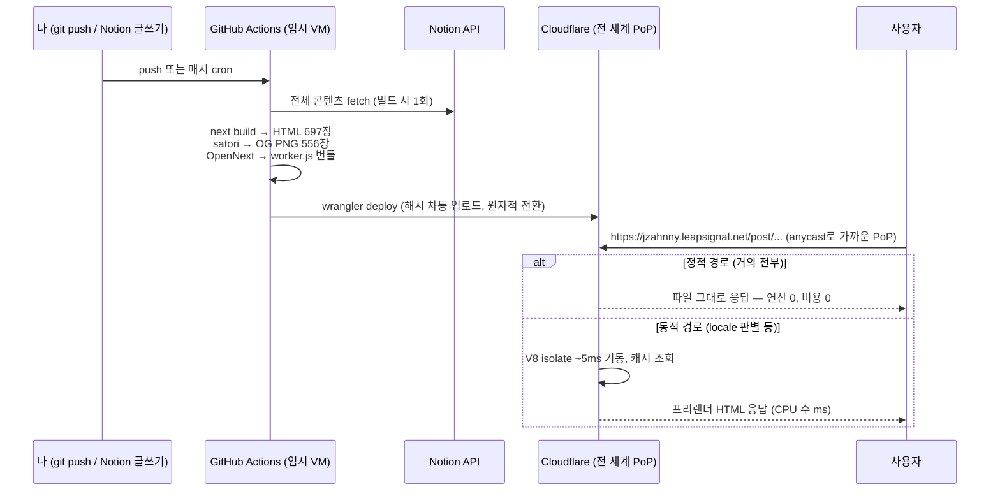

# 지금 배포 방식은 어떻게 동작하는가 — Vercel과의 비교로 이해하기

> 작성일: 2026-07-14
> 대상 독자: Next.js + GitHub + Vercel 배포에 익숙한 사람
> 목적: push 한 번이 사용자 브라우저에 도달하기까지의 전 과정을 CS 원리 수준까지 이해한다.

---

## 0. 한 문장 요약

> Vercel은 "요청이 올 때마다 서버(함수)를 깨워 HTML을 만들 수 있는 환경"을 팔고,
> 지금 구조는 "**HTML을 전부 미리 만들어 전 세계에 복사해두고, 서버는 길 안내만 하는 구조**"다.

같은 Next.js 코드인데 실행되는 **시점**과 **장소**가 다르다. 이 차이가 비용·안정성 차이의 전부다.

---

## 1. 큰 그림: 두 방식의 비교

```
[Vercel 방식]
push → Vercel이 빌드 → 결과를 Vercel 인프라에 배치
사용자 요청 → Vercel Edge → (캐시 미스면) 서버리스 함수 기동 → HTML 생성 → 응답
                              └─ 이 "함수 기동 + 생성"이 요청마다 과금됨 (ISR Write, CPU)

[지금 방식]
push → GitHub Actions가 빌드 (HTML 전부 + OG 이미지까지 이 시점에 완성)
     → Cloudflare에 "완성된 파일들 + 아주 작은 라우터 프로그램" 업로드
사용자 요청 → Cloudflare 엣지 → 파일 그대로 응답 (서버 연산 0, 과금 0)
```

핵심 이동: **연산이 "요청 시점(runtime)"에서 "빌드 시점(build time)"으로 옮겨졌다.**
CS 용어로는 precomputation(사전 계산) 트레이드오프다 — 계산을 미리 해두면 응답은 빨라지고 싸지지만, 데이터가 바뀌면 다시 계산해야 한다. 그 "다시 계산"을 우리는 1시간마다 도는 cron으로 해결했다 (기존 ISR revalidate 3600초와 같은 신선도).

---

## 2. 등장인물 소개

| 역할 | Vercel 시절 | 지금 | 하는 일 |
|---|---|---|---|
| 빌드 머신 | Vercel 빌드 서버 | **GitHub Actions** | push 감지, `next build` 실행 |
| 변환기 | (Vercel 내부 비공개) | **OpenNext** | Next.js 산출물을 Cloudflare가 실행할 수 있는 형태로 변환 |
| 배포 도구 | (자동) | **wrangler** | 파일들을 Cloudflare API로 업로드 |
| 실행 환경 | AWS Lambda (마이크로VM) | **Cloudflare Workers (V8 isolate)** | 동적 요청 처리 |
| 파일 서빙 | Vercel CDN | **Workers Static Assets** | 정적 파일 전달 (무료·무제한) |

Vercel의 편리함은 "이 다섯 역할을 전부 숨겨준 것"이었다. 지금은 각 역할이 눈에 보이는 부품으로 분리됐고, 그래서 각 부품을 공짜 티어로 골라 조립할 수 있게 됐다.

---

## 3. push부터 브라우저까지: 전체 여정 8단계

### 3-1. `git push` → GitHub Actions 기동

`.github/workflows/deploy.yml`의 `on: push: branches: [main]` 때문에, GitHub가 push 이벤트를 받으면 **우분투 가상머신(runner)을 하나 새로 만들어** 우리 워크플로를 실행한다. 이 VM은 매번 깨끗한 새 것이다 — 그래서 `pnpm install`부터 다시 한다 (lockfile 덕에 항상 같은 의존성이 설치된다. 이게 "로컬에선 되는데 CI에선 안 돼요"를 잡는 재현성의 원리이고, 실제로 우리도 로컬의 npm/pnpm 혼합 설치 때문에 CI에서만 터지는 버그를 여럿 잡았다).

`schedule: cron: "17 * * * *"`은 push가 없어도 매시 17분에 같은 일을 시킨다 — Notion 글 변경분을 주기적으로 반영하기 위해서다.

### 3-2. `next build` — 여기서 "서버가 할 일"을 미리 다 해버린다

Vercel 시절과 **완전히 같은 명령**이다. 다른 것은 우리가 코드에서 바꾼 두 가지 설정뿐:

- `fallback: 'blocking'` → `false`: 예전에는 "빌드에 없는 URL이 오면 그때 만들어줘"였다. 지금은 "빌드에 없는 URL은 404"다.
- `revalidate` 제거: "N초마다 다시 만들어줘"를 없앴다.

이 두 가지가 빠지면 Next.js는 **getStaticPaths가 반환한 모든 경로에 대해 getStaticProps를 실행해서 완성된 HTML 파일을 토해낸다** (우리 블로그는 697페이지). 이 시점에 Notion API 호출이 전부 일어난다 — 즉 Notion과의 통신은 이제 **빌드 머신과 Notion 사이**의 일이지, 사용자 요청과는 무관하다.

> 여기가 ISR 사고의 근본 원인이 제거된 지점이다. 예전 구조에서 `post/[...slug]` + `fallback: 'blocking'`은 "무한한 URL 공간의 어떤 주소든 요청이 오면 서버가 페이지를 생성한다"는 뜻이었다. 봇이 존재하지 않는 주소를 210만 번 긁자 210만 번의 생성(=ISR Write 과금)이 일어났다. 지금은 같은 봇이 와도 "그런 파일 없음 → 404 파일 응답"으로 끝난다. 연산이 없으니 과금도 없다.

### 3-3. `postbuild` — OG 이미지 사전 생성 (satori)

Vercel 시절 OG 이미지는 `/api/og`라는 **엣지 함수가 요청 시점에** 그렸다. 지금은 빌드 직후 스크립트가 전 페이지 분량을 미리 그려 `public/og-images/*.png`로 저장한다.

그리는 원리(satori)가 재미있는 부분이다:

1. React 컴포넌트(SocialCard)를 **브라우저 없이** 렌더링한다. satori는 JSX 트리를 받아 flexbox 레이아웃 계산을 자체 구현(Yoga 엔진)으로 수행한다 — "브라우저의 레이아웃 엔진만 뚝 떼어낸 것"이라 보면 된다.
2. 계산된 좌표에 텍스트·이미지를 배치한 **SVG 문서**를 만든다. 글자는 우리가 넘겨준 TTF 폰트에서 글리프(윤곽선)를 찾아 벡터 패스로 박아 넣는다 — 그래서 폰트 파일에 해당 글자가 없으면 □(tofu)가 나온다 (7/14에 겪은 깨짐의 원인: 유니코드 조각 폰트).
3. resvg(Rust 래스터라이저)가 SVG를 1200×630 PNG 픽셀로 굽는다.

예전 puppeteer 방식은 이 전 과정을 "진짜 Chrome을 띄워서 스크린샷"으로 했다 — 결과는 같지만 Chrome 프로세스(수백 MB)가 필요해서 서버리스에서 비싸고 느렸다. satori는 순수 계산이라 가볍다.

### 3-4. `opennextjs-cloudflare build` — Next 서버를 "한 파일"로 압축

`next build`의 산출물은 원래 **Node.js 서버가 읽는 폴더 구조**(.next/)다. Vercel은 이걸 자기 Lambda에 맞게 내부적으로 변환한다. OpenNext는 그 변환의 오픈소스 버전이고, Cloudflare 어댑터는 타깃이 Lambda가 아니라 Workers다.

하는 일:

1. Next.js의 요청 처리 코드(라우팅, i18n locale 판별, 헤더 처리…)와 우리 페이지 서버 코드를 **esbuild로 전부 하나의 `worker.js`로 번들**한다. Workers에는 파일시스템이 없어서 "필요한 파일을 그때그때 require"가 불가능하기 때문에, 모든 것이 한 덩어리 안에 있어야 한다.
   - 이 과정에서 겪은 문제들이 전형적이다: 네이티브 바이너리(sharp/Chromium)는 V8 isolate에서 실행 불가 → 제거, pnpm의 심링크 격리 구조에서 참조가 끊김 → hoisted 레이아웃으로 전환.
2. 완성된 HTML·JS·CSS·이미지는 `assets/` 폴더로 분리한다 — 이 부분은 worker를 거치지 않고 서빙된다.
3. `populateCache`: 프리렌더된 페이지 데이터(HTML + JSON)를 assets 안의 특수 경로(`cdn-cgi/_next_cache/`)에 복사한다. worker가 "이 페이지 만들어둔 것 있나?"를 조회하는 **읽기 전용 캐시**다. 우리는 전 페이지가 프리렌더라 이 캐시가 항상 적중하고, 따라서 worker가 페이지를 재생성할 일이 없다.

### 3-5. `wrangler deploy` — 해시 기반 차등 업로드

wrangler는 Cloudflare API로 파일을 올리는데, 파일마다 **내용 해시**를 계산해 서버에 "이 해시들 중 없는 것만 알려줘"라고 묻고 그 차이분만 업로드한다 (배포 로그의 "Uploaded 6 files (446 already uploaded)"가 이것). 내용이 같으면 파일명이 달라도 다시 안 올린다 — git이 객체를 저장하는 방식과 같은 content-addressed storage 아이디어다.

업로드가 끝나면 새 버전이 **원자적으로(atomic)** 활성화된다. "절반은 옛 버전, 절반은 새 버전"인 순간이 없다.

### 3-6. DNS와 애니캐스트 — 사용자가 "가까운 서버"를 찾는 원리

`jzahnny.leapsignal.net`의 DNS를 조회하면 Cloudflare의 IP(104.21.x.x)가 나온다. 그런데 이 IP는 특정 서버 한 대가 아니다 — **전 세계 330여 개 데이터센터가 전부 같은 IP를 광고**한다(anycast). 인터넷 라우팅(BGP)은 "가장 가까운 광고자"에게 패킷을 보내므로, 서울 사용자는 서울 PoP에, 파리 사용자는 파리 PoP에 자동으로 붙는다. 별도의 로드밸런서 없이 지리적 분산이 공짜로 얻어지는 구조다.

### 3-7. 엣지에서의 요청 처리 — 정적이면 그냥 파일, 동적이면 isolate

서울 PoP에 도착한 요청은 두 갈래로 나뉜다:

- **정적 자산에 있는 경로** (`/_next/static/...`, 이미지, OG PNG, 그리고 프리렌더된 HTML): PoP이 파일을 그대로 응답한다. **worker 실행 없음 = 무료·무제한**. 이게 우리 트래픽의 사실상 전부다.
- **worker가 필요한 경로** (예: `/`에서 Accept-Language 보고 en/ko 판별, `/api/search-notion`): 여기서 Workers의 핵심 기술이 나온다.

**V8 isolate vs 컨테이너 — 콜드스타트가 밀리초인 이유**

AWS Lambda(=Vercel 함수의 기반)는 요청마다 마이크로VM/컨테이너를 준비한다 — OS 수준 격리라 안전하지만 기동에 수백 ms~수 초가 든다(콜드스타트). Cloudflare Workers는 **Chrome이 탭마다 쓰는 V8 isolate**로 격리한다. 이미 떠 있는 V8 런타임 안에 격리된 힙 하나를 더 만드는 것이라 기동이 ~5ms다. 대신 제약이 있다: Node.js 전체가 아니라 웹 표준 API 중심이고(그래서 nodejs_compat 플래그와 OpenNext 어댑터가 필요), 네이티브 바이너리를 못 돌린다(그래서 sharp/Chromium을 걷어냈다).

우리 worker가 하는 일은 "locale 판별 → 캐시에서 프리렌더 HTML 꺼내 응답" 수준이라 CPU를 거의 안 쓴다. 무료 플랜의 요청당 CPU 10ms 제한 안에 넉넉히 들어오는 이유고, **월 $0이 성립하는 이유**다. (I/O 대기 시간은 CPU 시간에 안 잡힌다는 것도 중요한 디테일 — 프록시성 API는 사실상 공짜다.)

### 3-8. 방어선 — 요청이 worker에 닿기도 전에

M1에서 존 전체에 걸어둔 것들이 worker **앞**에서 작동한다: Bot Fight Mode(봇 시그니처 차단), rate limit(IP당 60req/10s), 캐시 규칙. Vercel 사고의 교훈("비용이 발생하는 지점 앞에 방어선이 없었다")을 구조로 반영한 것이다. 다만 지금은 방어선이 뚫려도 뒤에 있는 게 정적 파일이라 애초에 뚫을 "비용"이 없다.

---

## 4. 서비스별 변형 — 같은 원리의 세 가지 농도

| 서비스 | 구성 | worker가 하는 일 |
|---|---|---|
| labs-portal, eclipse | **assets만** (worker 코드 0줄) | 없음 — 100% 파일 서빙 |
| ypjr | assets + 50줄 worker | `/api/og` 프록시 1개만 (`run_worker_first: ["/api/*"]`로 그 외 경로는 worker 우회) |
| blog, noxionite | assets + OpenNext worker | i18n 라우팅 + 프리렌더 캐시 조회 + 검색 API |

농도는 달라도 원칙은 하나다: **worker는 최소한만, 파일은 최대한.**

---

## 5. Vercel과의 개념 대응표

| Vercel에서 익숙했던 것 | 지금의 대응물 |
|---|---|
| push하면 자동 배포 | GitHub Actions `on: push` |
| Preview 배포 | (미구성 — 필요하면 PR마다 `wrangler versions upload`로 가능) |
| 환경변수 대시보드 | GitHub Secrets(빌드용) + `wrangler secret`(런타임용) |
| ISR revalidate | GitHub Actions cron 재빌드 |
| `/api/og` 엣지 함수 | 빌드 시 satori 사전 생성 |
| Vercel Analytics | (미구성 — Cloudflare 대시보드 트래픽 통계로 대체 가능) |
| 함수 로그 | `wrangler tail` (실시간 스트리밍) |
| 롤백 | `git revert` + push, 또는 Cloudflare 대시보드에서 이전 버전 선택 |

---

## 6. 이 구조의 트레이드오프 (정직한 단점)

1. **빌드가 느리다**: 요청 시점 생성이 없으니 전체를 매번 다시 만든다 (블로그 697페이지 + Notion API 속도 제한 때문에 CI에서 수십 분). 대응: 동시성·재시도 조정으로 안정화했고, 어차피 백그라운드 cron이라 사람이 기다릴 일은 없다.
2. **새 글 반영이 즉시가 아니다**: 최대 1시간 (수동 트리거로 즉시 가능). 기존 revalidate 3600과 동일한 수준.
3. **빌드에 없는 URL은 404다**: Notion 본문 안에 중첩된 하위 페이지로 직접 들어가는 옛 URL 패턴은 죽는다 (실측상 내부 링크에서 사용 0건이라 수용).
4. **부품이 보인다**: Vercel이 숨겨주던 다섯 역할을 우리가 직접 본다. 대신 각 단계가 로그로 관찰 가능하고, 특정 업체에 인질로 잡히지 않는다 — 이번 이전 자체가 그 증명이다.

---

## 7. 전체 흐름 다이어그램



---

## 8. 스스로 점검해보기 (이해 체크)

1. 봇이 `jzahnny.leapsignal.net/post/asdfasdf`를 100만 번 긁으면 무슨 일이 일어나고, 비용은 왜 0인가?
   <details><summary>답</summary>빌드에 없는 경로 → 프리렌더된 404 파일이 그대로 응답된다. 파일 서빙은 worker 실행이 아니므로 과금 대상 자체가 아니다. (그 전에 rate limit이 IP를 차단한다)</details>
2. Notion에서 글을 고쳤는데 사이트에 바로 안 보인다. 어디서 무엇을 기다리고 있는 건가?
   <details><summary>답</summary>다음 매시 17분 cron이 GitHub Actions에서 전체를 재빌드할 때까지. 급하면 GitHub → Actions → Deploy → Run workflow로 즉시 실행.</details>
3. Workers 콜드스타트가 Lambda보다 100배쯤 빠른 구조적 이유는?
   <details><summary>답</summary>OS/VM을 새로 켜는 게 아니라, 이미 떠 있는 V8 런타임 안에 격리 힙(isolate)만 하나 만들기 때문.</details>
